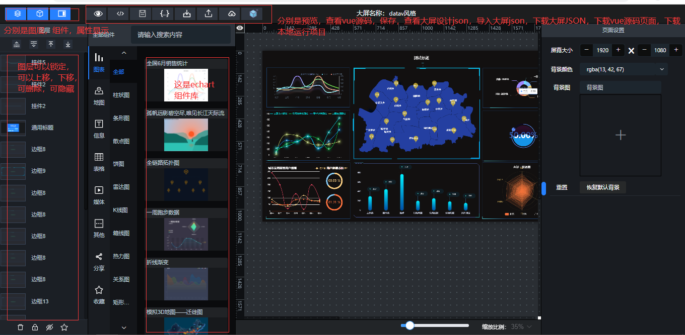
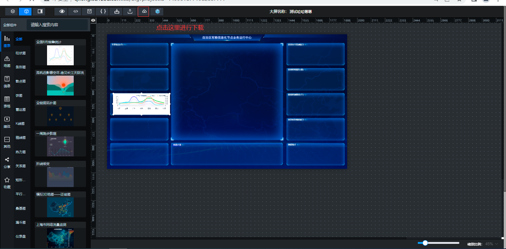
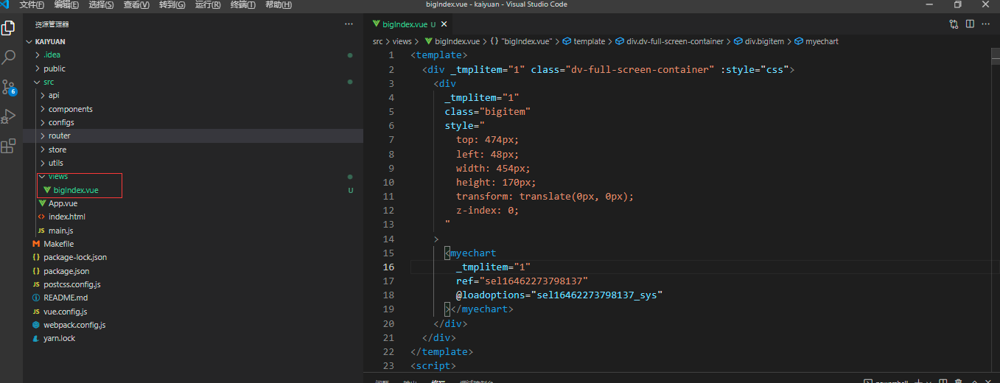
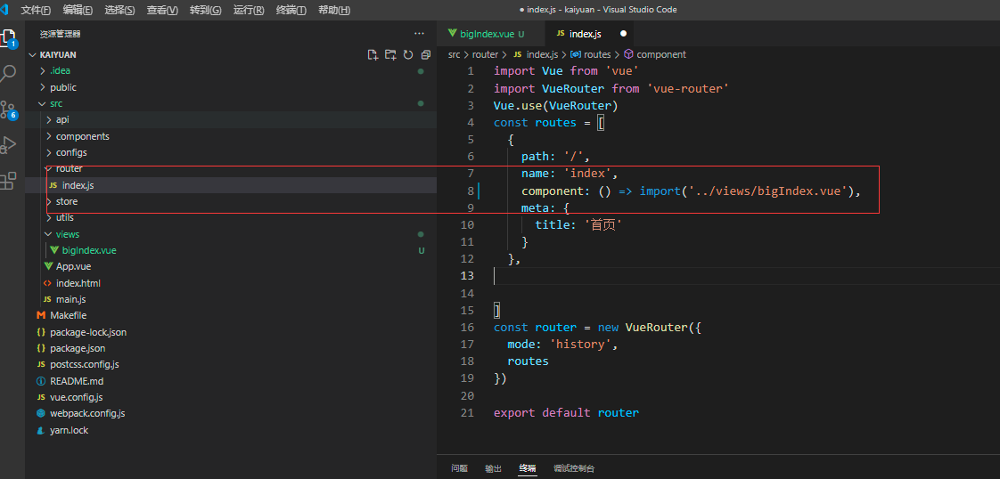
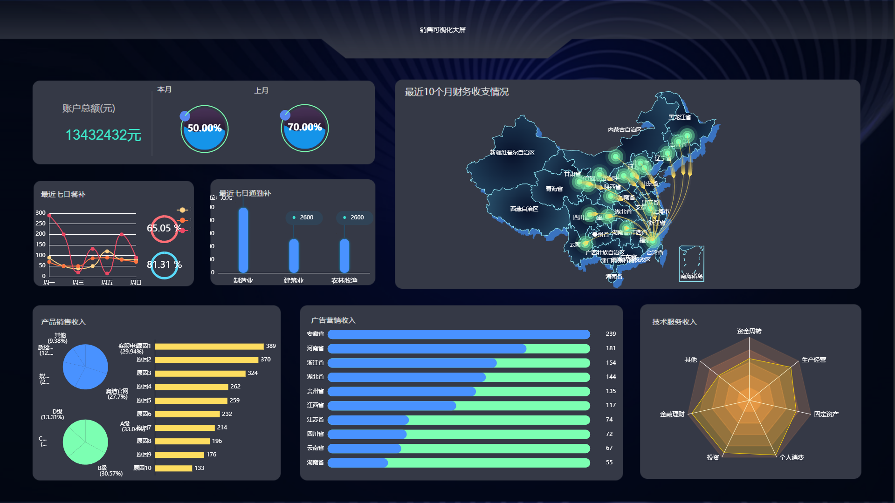

简搭云可视化大屏设计，集成有2万+的echart组件，全国地图，34个省，344个市，3020个区县的，全国41636个乡镇地图的GeoJson,引入dataV组件集成，canvas动画背景组件20个，可视化大屏设计器采用element ui框架开发的。

相比市面上面其它的可视化大屏设计器工具，该设计器的优点有：

1.界面风格仿写阿里的datav样式编写，界面大气，优美。

2.拥有2万+的echart组件，无需了解echart可以轻松做出各种统计报表图。

3.拥有全国41636个乡镇地图的GeoJson，全国乡镇地图网络上免费的是没有的，这里目前全部免费。

4.可视化大屏设计采用vue源码动态渲染，充分支持开发者的二次开发，为后期动态绑定数据统计提供扩展。

5.可视化大屏设计因为采用vue源码动态渲染，所以支持大屏设计本地下载，并提供了运行项目载体提供下载，将vue文件下载后可拷贝到运行项目中，就可以本地运行，就是离线运行了，与我的可视化大屏设计站点就没有任何关系了。

文档地址：[http://qifeng.321zou.com/](http://qifeng.321zou.com/)

预览地址：[http://bg.kyform.cn/](http://bg.kyform.cn/)

设计好的大屏设计预览效果

可视化大屏设计器界面效果

设计好的可视化大屏

全国地图，34个省，344个市，3020个区县的，全国41636个乡镇地图的GeoJson

登录界面

 **大屏设计好的vue页面本地运行步骤**

- 第一步：下载本项目。

- 第二步 设计你想要的大屏效果，点击下图红色框位置进行下载

- 第三步 将vue页面拷贝到项目中，如下图位置：

- 第四步 配置路由，如下图：

- 第五步：`npm install` 安装依赖  `npm run serve`运行项目 运行效果如下：

